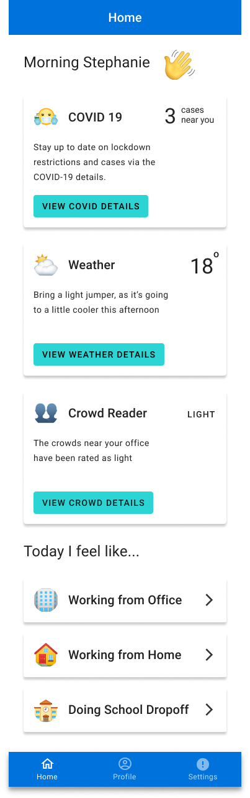
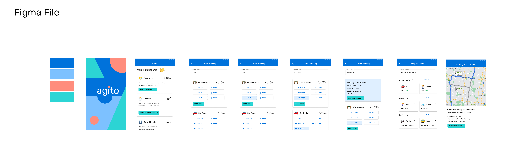

# govhack-2021-coolio-agito
Govhack 2021 submission - Team coolio - Project Agito

Agito app is an Android (and future iOS) App that empowers you to make a more informed decision on whether it’s a WFO or WFH day in the new COVID normal world. By using open APIs to showcase COVID-19 data, exposure sites, weather updates and crowd density data, Agito helps you decide the best mode of transport and route to take to get to your workplace safely. The office management system allows you to book a desk, meeting room or car park at your workplace to support COVID safety.

We used data sets from the Victorian government including Victorian coronavirus data, PTV metro routes and stations, bluetooth travel API and traffic signal volume.
The Agito app also collects data about workers’ new COVID normal behaviour, modes of transport and frequency of working from home and the office. This collection of data will be pivotal in understanding the impacts and opportunities in infrastructure and the broader transport system. Using open data and APIs to showcase COVID-19 data, exposure sites, weather updates and crowd density data, Agito helps you decide the best mode of transport and route to take to get to your workplace safely.

## List of datasets used 

### Datasets by Screen/Feature

### Weather
* open weather data - https://openweathermap.org/current

### Covid 19
* Covid 19 - https://discover.data.vic.gov.au/dataset/victorian-coronavirus-data

### Crowd reader
* https://discover.data.vic.gov.au/dataset/ptv-metro-tram-routes
* https://discover.data.vic.gov.au/dataset/ptv-metro-train-stations
* https://discover.data.vic.gov.au/dataset/department-of-transport-bluetooth-travel-api
* https://discover.data.vic.gov.au/dataset/traffic-signal-volume-data

### Directions
* Google maps API
* https://discover.data.vic.gov.au/dataset/ptv-metro-tram-routes
* https://discover.data.vic.gov.au/dataset/ptv-metro-train-stations
* https://discover.data.vic.gov.au/dataset/principal-bicycle-network-pbn
* https://discover.data.vic.gov.au/dataset/bluetooth-travel-time-updates-every-2-minutes
* https://discover.data.vic.gov.au/dataset/ptv-timetable-and-geographic-information-2015-gtfs

### Parking and Desk booking data
* Closed dataset created by participating companies.
* Public parking - https://www.melbourne.vic.gov.au/about-melbourne/research-and-statistics/city-economy/census-land-use-employment/Pages/clue.aspx

## Datasets generated by users of app

* Analytics/preferences on the type of transport users prefer
* Primary concerns of users for choosing a specific mode of transport (weather/ covid/ cost/ time, etc)
* Parking spaces for each participating company (closed)
* Desk spaces for each participating company (closed)

# Prototypes 

